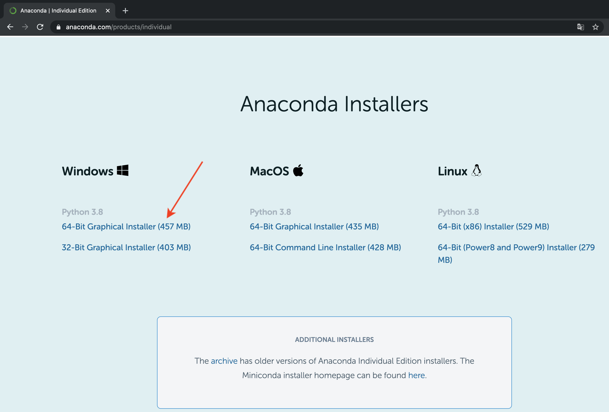
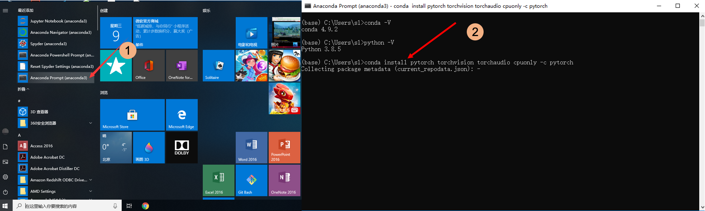
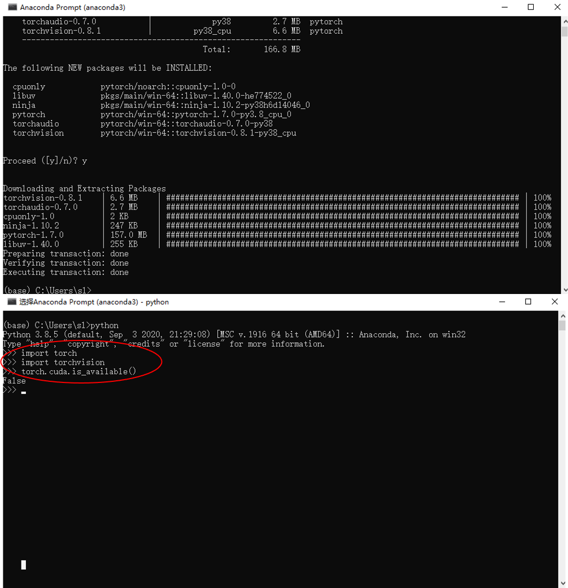
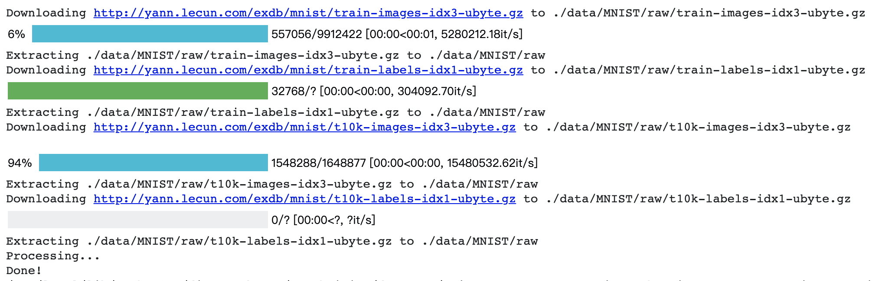

# IoT-and-Edge-Intelligence
PyTorch Deep Learning training tutorial on Edge Computing devices.

- [IoT-and-Edge-Intelligence](#iot-and-edge-intelligence)
  - [1.设置PyTorch运行环境](#1设置pytorch运行环境)
    - [1.1 Anaconda](#11-anaconda)
    - [1.2 PyTorch](#12-pytorch)
  - [2.使用PyTorch训练CNN](#2使用pytorch训练cnn)
    - [2.0 打开Jupyter notebook](#20-打开jupyter-notebook)
    - [2.1 定义LeNet5网络模型](#21-定义lenet5网络模型)
    - [2.2 加载并标准化MNIST](#22-加载并标准化mnist)
    - [2.3 定义损失函数和优化器](#23-定义损失函数和优化器)
    - [2.4 训练和测试网络](#24-训练和测试网络)
  - [3.配置CNN训练参数](#3配置cnn训练参数)

## 1.设置PyTorch运行环境
### 1.1 Anaconda
[Anaconda](https://www.anaconda.com/)是一个可以便捷获取包且对包进行管理，同时对环境进行统一管理的发行版本。Anaconda包含了conda、Python等在内的超过180个科学包及其依赖项。

下面我们将在Windows 10系统下先安装Anaconda，然后使用Anaconda中的`conda`命令安装Pytorch。

**下载安装程序** 首先从Anaconda官方网站的下载页面`https://www.anaconda.com/products/individual`下载其安装程序。



**安装** 双击打开下载好的 `Anaconda3-2020.11-Windows-x86_64.exe.exe` ，然后按照如下图所示的步骤安装好Anaconda。在安装过程中可以自定义安装路径，其余设置保持默认即可。安装时间大概10+分钟。


### 1.2 PyTorch
> [PyTorch](https://pytorch.org/). An open source machine learning framework that accelerates the path from research prototyping to production deployment.

前面我们已经安装好了Anaconda，因此只需要使用 `conda` 运行简单的命令就可以安装PyTorch。

**PyTorch安装命令** 首先根据平台及需求到PyTorch官方网站获得安装命令，这里我们的安装命令是 `conda install pytorch torchvision torchaudio cpuonly -c pytorch` 。


**安装** 然后，打开Windows 10的开始菜单，选择 `Anaconda Prompt(anaconda3)` 打开Anaconda终端，执行上一步获得的安装命令。



**测试PyTorch** 等待安装成功之后，可以在打开的终端上先运行 `python` 命令，然后运行下面的程序测试PyTorch是否安装成功。如果执行过程中程序没有报错，则安装成功。
``` Python
import torch
import torchvision

torch.cuda.is_available()
```



## 2.使用PyTorch训练CNN
### 2.0 打开Jupyter notebook
从Windows 10的开始菜单中选择 `Jupyter Notebook(anaconda3)` 打开Python开发环境，并新建一个Python3 文件。开始之前可以先运行之前的PyTorch测试程序，查看PyTorch运行环境是否正常。


一切正常，下面将正式开始使用PyTorch来训练CNN，这里我们使用LeNet5来训练 [MNIST](http://yann.lecun.com/exdb/mnist/) 数据集。

### 2.1 定义LeNet5网络模型
这里，我们使用下面神经网络LeNet5可以对数字数据集MNIST进行分类，网络结构如下：


这是一个简单的CNN模型，模型接受一个输入，然后将它送入下一层，一层接一层的传递，最后给出输出。
>  一个神经网络的典型训练过程如下：
> + 定义包含一些可学习参数(或者叫权重）的神经网络
> + 在输入数据集上迭代
> + 通过网络处理输入
> + 计算loss(输出和正确答案的距离）
> + 将梯度反向传播给网络的参数
> + 更新网络的权重，一般使用一个简单的规则：`weight = weight - learning_rate * gradient`
> 
> From: https://pytorch.apachecn.org/docs/1.4/blitz/neural_networks_tutorial.html

首先我们导入必要的包，并预置一些训练过程中会用到的（超）参数，重要的包括批量大小和学习率。
``` Python
# 导入必要的包
import torch
import torch.nn as nn
import torch.functional as F
import torchvision
import torchvision.transforms as transforms
import torch.optim as optim

# 预置一些必要的（超）参数
BATCHSIZE = 128 # 批量大小
LR = 0.02       # 学习率
EPOCH = 10      # 迭代整个训练集的次数
INTERVAL = 100  # 输出训练过程中间信息（损失值）的间隔

# 选择使用GPU设备，如果有的话
device = torch.device(
    "cuda:0") if torch.cuda.is_available() else torch.device("cpu")

# print(device)
```
定义卷积神经网络LeNet5：
``` Python
# 定义LeNet5 网络模型
class LeNet5(nn.Module):
    def __init__(self):
        super(LeNet5, self).__init__()
        self.features = nn.Sequential(
            nn.Conv2d(1, 6, 5), # 32x32x1 -> 28x28x6
            nn.ReLU(True),
            nn.MaxPool2d(2, 2), # 28x28x6 -> 14x14x6
            nn.Conv2d(6, 16, 5), # 14x14x6 -> 10x10x16
            nn.ReLU(True),
            nn.MaxPool2d(2, 2), # 10x10x16 -> 5x5x16
            #nn.Conv2d(16, 120, 5) # 5x5x16 -> 1x1x120
        )
        self.classifier = nn.Sequential(
            nn.Linear(5*5*16, 120),
            nn.ReLU(True),
            nn.Linear(120, 84),
            nn.ReLU(True),
            nn.Linear(84, 10)
        )

    def forward(self, x):
        x = self.features(x)
        x = x.view(-1, 5 * 5 * 16)
        x = self.classifier(x)
        return x

# 需要训练的模型
net = LeNet5()
net.to(device) # 将模型移动到对应的设备上(CPU or GPU)
```
输出模型结构如下：
``` Python
LeNet5(
  (features): Sequential(
    (0): Conv2d(1, 6, kernel_size=(5, 5), stride=(1, 1))
    (1): ReLU(inplace=True)
    (2): MaxPool2d(kernel_size=2, stride=2, padding=0, dilation=1, ceil_mode=False)
    (3): Conv2d(6, 16, kernel_size=(5, 5), stride=(1, 1))
    (4): ReLU(inplace=True)
    (5): MaxPool2d(kernel_size=2, stride=2, padding=0, dilation=1, ceil_mode=False)
  )
  (classifier): Sequential(
    (0): Linear(in_features=400, out_features=120, bias=True)
    (1): ReLU(inplace=True)
    (2): Linear(in_features=120, out_features=84, bias=True)
    (3): ReLU(inplace=True)
    (4): Linear(in_features=84, out_features=10, bias=True)
  )
)
```

### 2.2 加载并标准化MNIST
标准的MNIST数据集中的图像尺寸为 `1*28*28` ,但是这里我们的LeNet5模型接受的输入为 `1*32*32`， 借助 `torchvision` 提供的 `transforms` 工具包，我们可以轻松的调整图片尺寸并对如下进行标准化。如果本地没有MNIST数据集，那么设置参数 `download=True` 则程序会自动从互联网下载数据集到本地。

``` Python
# 加载并标准化MNIST数据集
# 如果本地不存在MNIST数据集，那么程序将自动从网络上下载
# transforms
transform = transforms.Compose(
    [transforms.Resize((32, 32)),
     transforms.ToTensor(),
    transforms.Normalize((0.5,), (0.5,))])

# datasets, download MNIST if download is True
trainset = torchvision.datasets.MNIST('./data',
    download=True,
    train=True,
    transform=transform)
testset = torchvision.datasets.MNIST('./data',
    download=True,
    train=False,
    transform=transform)

# dataloaders
trainloader = torch.utils.data.DataLoader(trainset,
    batch_size=BATCHSIZE,
    shuffle=True, num_workers=2)
testloader = torch.utils.data.DataLoader(testset, 
    batch_size=BATCHSIZE,
    shuffle=False, num_workers=2)
```
运行输出：



### 2.3 定义损失函数和优化器

``` Python
# 定义损失函数和优化器。一个损失函数接受一对(output, target)作为输入，计算一个值来估计网络的输出和目标值相差多少。
# 这里使用交叉熵损失函数，SGD作为优化器
criterion = nn.CrossEntropyLoss()
optimizer = optim.SGD(net.parameters(), lr=LR)
```

### 2.4 训练和测试网络
将训练和测试过程实现为函数：
``` Python
"""
完成一个Epoch的训练，即迭代训练一遍训练集
"""
def train(epoch):
    net.train() # 将模型设置为train 模式
    running_loss = 0.0
    for i, (images, labels) in enumerate(trainloader):
        images, labels = images.to(device), labels.to(device)
        # 模型梯度值清零
        optimizer.zero_grad()

        # forward + backward + optimize
        output = net(images)
        loss = criterion(output, labels)

        # 统计并输出训练loss
        running_loss += loss.detach().cpu().item()
        if (i+1) % INTERVAL == 0:
            print('Train - [Epoch %d /Iteration %d] Loss: %f' % (epoch, i+1, running_loss/INTERVAL))
            running_loss = 0.0

        # forward and update model parameters
        loss.backward()
        optimizer.step()

"""
在测试集上对模型进行测试，输出 test loss 和准确率
"""
def test(epoch):
    # 将模型设置为测试模式
    net.eval()
    total_correct = 0
    avg_loss = 0.0
    val_iteration = 0
    for i, (images, labels) in enumerate(testloader):
        images, labels = images.to(device), labels.to(device)
        output = net(images)
        avg_loss += criterion(output, labels).sum()
        # 统计预测正确的样本个数
        pred = output.detach().max(1)[1]
        total_correct += pred.eq(labels.view_as(pred)).sum()
        val_iteration += 1

    avg_loss /= val_iteration
    print('Test - [Epoch %d] Avg Loss: %f, Accuracy: %f %%' % (epoch, avg_loss.detach().cpu().item(), 100.0*float(total_correct) / len(testset)))
```
训练和测试
``` Python
# loop over the dataset multiple times
for epoch in range(EPOCH):
  train(epoch+1)
  test(epoch+1)
```
结果如下：
```
Train - [Epoch 1 /Iteration 100] Loss: 2.295071
Train - [Epoch 1 /Iteration 200] Loss: 2.261444
Train - [Epoch 1 /Iteration 300] Loss: 2.027999
Train - [Epoch 1 /Iteration 400] Loss: 1.155399
Test - [Epoch 1] Avg Loss: 0.520879, Accuracy: 84.280000 %
Train - [Epoch 2 /Iteration 100] Loss: 0.452537
Train - [Epoch 2 /Iteration 200] Loss: 0.304626
Train - [Epoch 2 /Iteration 300] Loss: 0.241123
Train - [Epoch 2 /Iteration 400] Loss: 0.213320
Test - [Epoch 2] Avg Loss: 0.156939, Accuracy: 95.120000 %
Train - [Epoch 3 /Iteration 100] Loss: 0.170911
Train - [Epoch 3 /Iteration 200] Loss: 0.152231
Train - [Epoch 3 /Iteration 300] Loss: 0.149747
Train - [Epoch 3 /Iteration 400] Loss: 0.128738
Test - [Epoch 3] Avg Loss: 0.105213, Accuracy: 96.690000 %
Train - [Epoch 4 /Iteration 100] Loss: 0.118659
Train - [Epoch 4 /Iteration 200] Loss: 0.116046
Train - [Epoch 4 /Iteration 300] Loss: 0.108657
Train - [Epoch 4 /Iteration 400] Loss: 0.104477
Test - [Epoch 4] Avg Loss: 0.087813, Accuracy: 97.190000 %
Train - [Epoch 5 /Iteration 100] Loss: 0.099965
Train - [Epoch 5 /Iteration 200] Loss: 0.086683
Train - [Epoch 5 /Iteration 300] Loss: 0.092032
Train - [Epoch 5 /Iteration 400] Loss: 0.089453
Test - [Epoch 5] Avg Loss: 0.068883, Accuracy: 97.710000 %
Train - [Epoch 6 /Iteration 100] Loss: 0.087565
Train - [Epoch 6 /Iteration 200] Loss: 0.080555
Train - [Epoch 6 /Iteration 300] Loss: 0.081706
Train - [Epoch 6 /Iteration 400] Loss: 0.073794
Test - [Epoch 6] Avg Loss: 0.068499, Accuracy: 97.690000 %
Train - [Epoch 7 /Iteration 100] Loss: 0.071711
Train - [Epoch 7 /Iteration 200] Loss: 0.070889
Train - [Epoch 7 /Iteration 300] Loss: 0.065875
Train - [Epoch 7 /Iteration 400] Loss: 0.078004
Test - [Epoch 7] Avg Loss: 0.066197, Accuracy: 97.760000 %
Train - [Epoch 8 /Iteration 100] Loss: 0.063024
Train - [Epoch 8 /Iteration 200] Loss: 0.066813
Train - [Epoch 8 /Iteration 300] Loss: 0.062429
Train - [Epoch 8 /Iteration 400] Loss: 0.062364
Test - [Epoch 8] Avg Loss: 0.050736, Accuracy: 98.250000 %
Train - [Epoch 9 /Iteration 100] Loss: 0.059291
Train - [Epoch 9 /Iteration 200] Loss: 0.057749
Train - [Epoch 9 /Iteration 300] Loss: 0.064181
Train - [Epoch 9 /Iteration 400] Loss: 0.051622
Test - [Epoch 9] Avg Loss: 0.062792, Accuracy: 97.820000 %
Train - [Epoch 10 /Iteration 100] Loss: 0.056045
Train - [Epoch 10 /Iteration 200] Loss: 0.055128
Train - [Epoch 10 /Iteration 300] Loss: 0.053635
Train - [Epoch 10 /Iteration 400] Loss: 0.054391
Test - [Epoch 10] Avg Loss: 0.049618, Accuracy: 98.290000 %
```

## 3.配置CNN训练参数